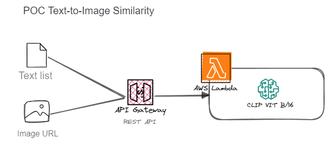
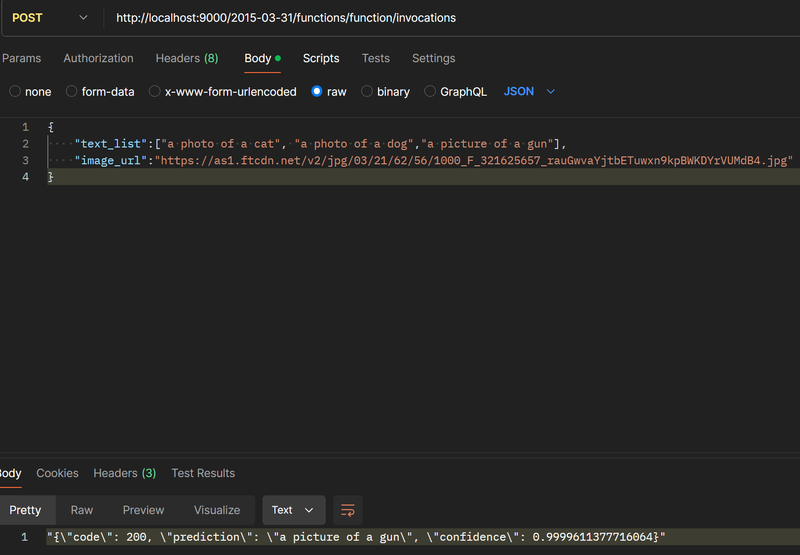
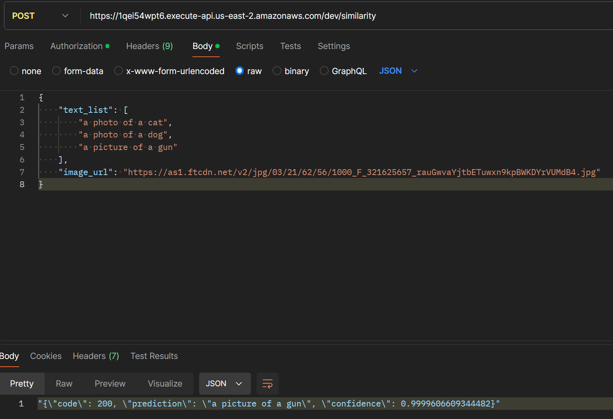

# ClipAWSLambdaPOC


Using AWS Lambda to host CLIP model for text to image similarity



Steps:

- Create a docker image and upload it (see Dockerfile) to an ECR in AWS (Install AWS CLI before). Find more details [here](https://docs.aws.amazon.com/lambda/latest/dg/python-image.html)

    ```bash
    #login and create an ECR repository
    aws ecr get-login-password --region <YOUR_REGION> | docker login --username AWS --password-stdin <YOUR_ACCOUNT_ID>.dkr.ecr.<YOUR_REGION>.amazonaws.com
    && aws ecr create-repository --repository-name <YOUR_ECR_REPO_NAME> --region <YOUR_REGION> --image-scanning-configuration scanOnPush=true --image-tag-mutability MUTABLE
    ```

- Build the docker image and test it locally.

    ```
    docker build --platform linux/arm64 -t img_txt_similarity:v0.1 .
    && docker run --rm --name text2img --platform linux/arm64 -p 9000:8080 img_txt_similarity:v0.1
    ```

    The app should be available locally at http://localhost:9000/2015-03-31/functions/function/invocations, you can use postman to test it locally before deploying. See image below.

    

- Save your docker image to the ECR and deploy Lambda function

    ```
    docker tag img_txt_similarity:v0.1 <YOUR_ACCOUNT_ID>.dkr.ecr.<YOUR_REGION>.amazonaws.com/<YOUR_ECR_REPO_NAME>:v0.1
    && docker push <YOUR_ACCOUNT_ID>.dkr.ecr.<YOUR_REGION>.amazonaws.com/<YOUR_ECR_REPO_NAME>:v0.1
    ```

    At this step you should be able to create your lambda function and expose it as a REST API using the AWS API Gateway service. If using an API Key, remember to add the `x-api-key` key to the header.

    